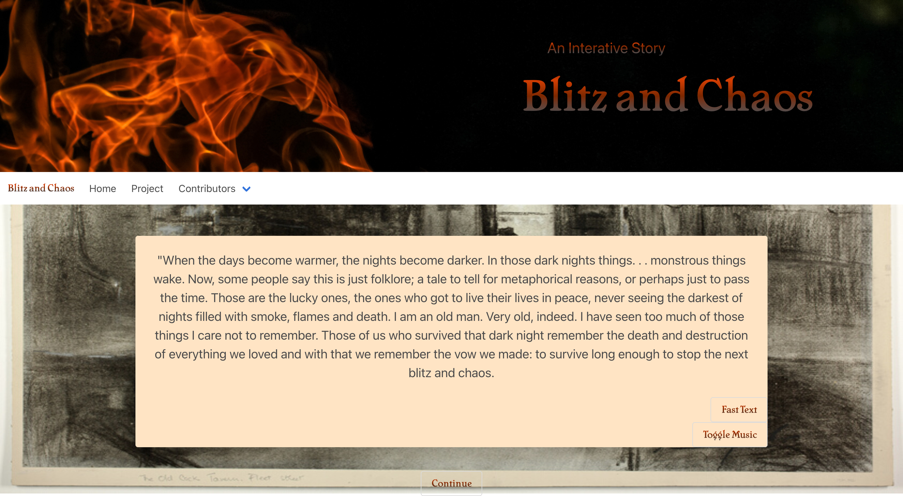

# Blitz and Chaos: An Interactive Story

## Description:

Have you ever daydreamed about being the hero facing off against a dragon? We have too. That's where the seeds of this project sprouted... in the fantasy of another world. 

Blitz and Chaos is a text-based, interactive story (run by JavaScript) providing you, the user, with a chance to play through a life as a hero. The choices you make along the way change the experience and outcome of your story. Who will you trust? Where will you go? Choose wisely and live to see the world saved or succumb to the dragon's fiery wrath. 

This application utilizes JavaScript to run through the text options. Choices cascade as you make different selections, leading you to unique sub-plots and then bringing you back to the main story. The use of several APIs provides immersive elements, such as sounds and images that set the scene. And the styling (using Bulma as a framework) pulls it all together. 

As a team, we learned much in putting together this project. We had to brainstorm innovative ways to use JavaScript, figure out how to incorporate various unique APIs, develop a clean UI that was composed of primarily text, and collaborate with four individuals over a number of pages. 

Blitz and Chaos now exists as a compact, interactive game that hopefully will provide many with entertainment. 

## Table of Contents:

- [Installation](#installation)
- [Usage](#usage)
- [Credits](#credits)
- [License](#license)

## Installation:

Play through the story [here](https://justinean.github.io/BlitzandChaos/). 

All of the files are also available through a simple download and clone from this GitHub, which you can then open in your browser from your local machine. 

## Usage:

Navigate to [Blitz and Chaos](https://justinean.github.io/BlitzandChaos/). 

Make your way through the story by reading the text and then clicking on the choices that you wish to make. The story text will unfold before your eyes as you progress. (There are also buttons that you can use to either toggle the music on/off or to speed up the experience by making words appear faster.)

Your place in the story is stored in LocalStorage, so that if you return to the game later, it will remember where you had left off. Your individual choices are also stored, and will impact which ending you will get. 

Additionally, navigate to our Project page using the navbar to learn more about our process and about our team. 

## Credits:

Our Team and their GitHub profiles: 
[Heather](https://github.com/HeatMarie)
[Justin](https://github.com/Justinean)
[Megan](https://github.com/msteblu)
[Mike](https://github.com/mgsteinmetz)

Attributions:
Styling: We used [Bulma](https://bulma.io/) for our CSS styling framework.
APIs: We utilized the [Freesound.org API](https://freesound.org/docs/api/authentication.html) for background music, and the [Pexels](https://www.pexels.com/api/) and [Art Institute of Chicago](https://api.artic.edu/docs/) APIs for background images.

(Attribution for individual songs and images are listed on our [Contributor's page](https://justinean.github.io/BlitzandChaos/contributorsPage.html).) 

## License:

This application is icensed under the [MIT](https://github.com/microsoft/vscode/blob/main/LICENSE.txt) license. 

